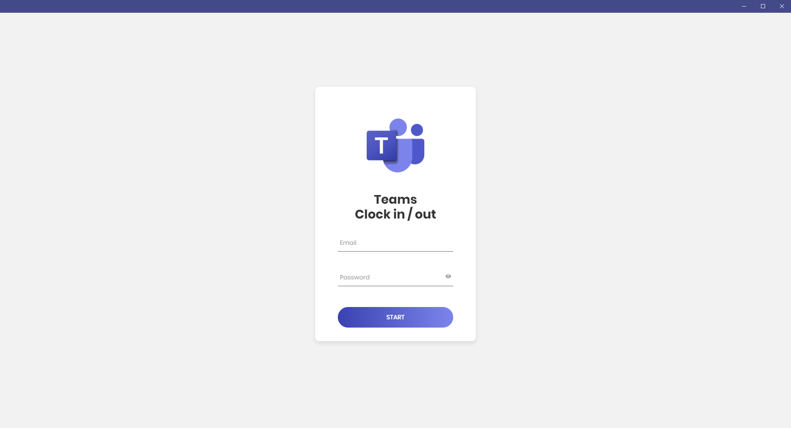
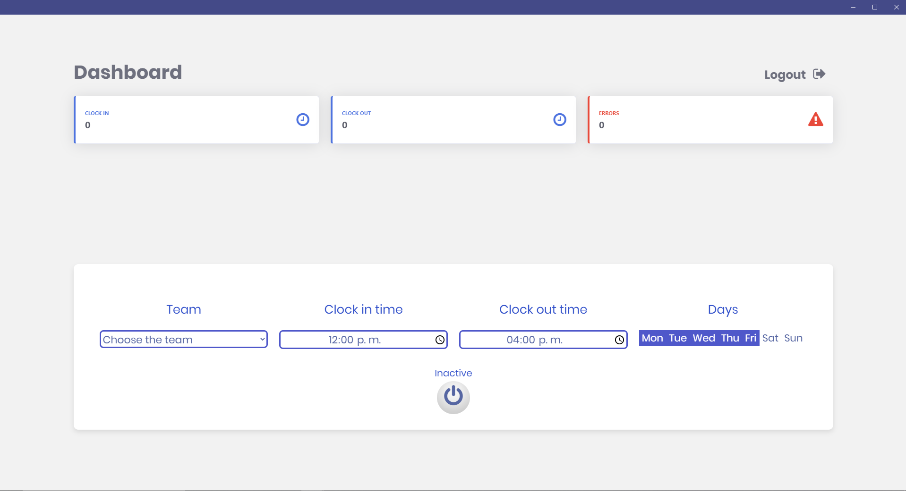

# Microsoft Teams - Clock in / out

A simple application for turn in and out ms teams open shifts with a timer and with a timer that activate it in the background.





## Dependencies

[Google Chrome] v84(https://www.google.com.mx/chrome/) (If you already have it installed you don't need to download anything else).

## Installation

Use the package manager [npm](https://www.npmjs.com/) to install node modules.

```bash
npm install
```

## Project Usage

Build installer for Linux

```
npm run linux
```

Build installer for MacOS

```
npm run mac
```
Build installer for Windows

```
npm run win
```

Development and testing
```
npm run start
```

## Contributing
Pull requests are welcome. For major changes, please open an issue first to discuss what you would like to change.

Please make sure to update tests as appropriate.

## Donations

BTC: **3QdeHa5PFtU9RruPiFmhbn7mynp7PEy4XZ**
ETH: **0xe933045841add12d7C5110FaD95ceCA27dE5298c**

## License
[CPL1.0](https://opensource.org/licenses/cpl1.0.txt)
